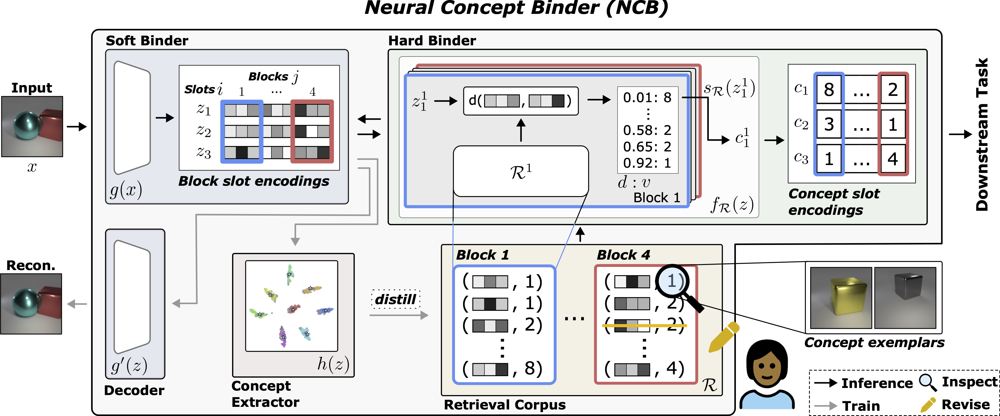
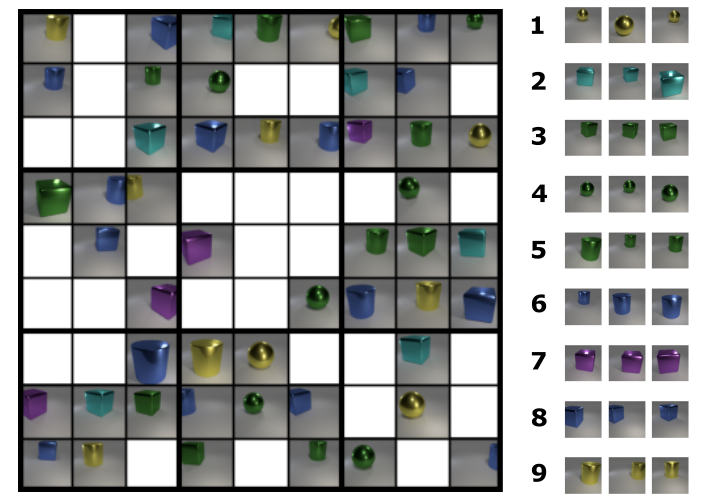

# NeuralConceptBinder

This is the official repository of the [Neural Concept Binder](https://arxiv.org/abs/2406.09949) article.
This repository contains all source code required to reproduce the experiments of the paper. 



## Datasets

Here we provide information on how to download the novel and evaluated datasets.

### CLEVR-Sudoku

We provide our novel CLEVR-Sudoku dataset [here](https://hessenbox.tu-darmstadt.de/getlink/fi5RUb2R7UobPiFBzorpEYPT/CLEVR_SUDOKU.zip). In the following, you can find an example of a CLEVR-Sudoku: 



For the CLEVR-Easy dataset we refer to <https://github.com/singhgautam/sysbinder>.

We provide the used CLEVR dataset [here](https://hessenbox.tu-darmstadt.de/getlink/fiTkYuSoR2VvA2JLj7EACkxo/CLEVR-4.zip).

We provide the datasets used to finetune NCBs hard binder (i.e., distill the concepts) at:
[CLEVR-Easy-1](https://hessenbox.tu-darmstadt.de/getlink/fiHHPQ537ViPaxdz6vD7e2d5/CLEVR-Easy-1.zip) 
and [CLEVR-1](https://hessenbox.tu-darmstadt.de/getlink/fiVCLMaZkEuf5f6HYG58sshV/CLEVR-4-1.zip).

These represent versions of the original datasets that contain single objects.

We provide the CLEVR-Hans classification dataset [here](https://hessenbox.tu-darmstadt.de/getlink/fiJ7Jm5YwLaPjj2Cjj2AxGrH/CLEVR-4-1-cls.zip) (single object) and [here](https://hessenbox.tu-darmstadt.de/getlink/fiDrNmUD4dMihFzhg8qigguo/CLEVR-4-4-cls.zip) (multi object)
(Please visit the [CLEVR-Hans](https://github.com/ml-research/CLEVR-Hans) repository for instructions on how to generate your own dataset in case you are interested).

## Model Checkpoints

We provide checkpoints of all trained models of our experiments as well as parameter files for [CLEVR-Easy](https://hessenbox.tu-darmstadt.de/getlink/fiNmsxY8anr52RGTwsQtzSxW/CLEVR-Easy.zip)
and [CLEVR](https://hessenbox.tu-darmstadt.de/getlink/fi6WzuWtQ87Px5P3ewEVNQyZ/CLEVR-4.zip). 
You can find the ckpts of the NLOTM baseline [here](https://hessenbox.tu-darmstadt.de/getlink/fiLgJBMQgKpaDKD82WDTGwVv/nlotm.zip).

## Docker

We have attached a Dockerfile to make reproduction easier. We further recommend to build your own docker-compose file
based on the DockerFile. To run without a docker-compose file:

1. ```cd docker/```

2. ```docker build -t neuralconceptbinder -f Dockerfile .```

3. ```docker run -it -v /pathto/NeuralConceptBinder:/workspace/repositories/NeuralConceptBinder -v /pathto/CLEVR-4-1:/workspace/datasets/CLEVR-4-1 --name neuralconceptbinder --entrypoint='/bin/bash' --runtime nvidia neuralconceptbinder```

Once the docker container has been generated, within the docker container please run these steps:

```
cd to “pathto/NeuralConceptBinder/“
run “pip install -e sysbinder”
```

## Quick Inference Demo (how to obtain concept-slot encs from trained model)

We provide a simple demo script on how to obtain concept-slot encodings from a trained NCB in ```inference_example.py```
and corresponding bash file ```scripts/inference_example/inference_example.sh```.

An example call based on a model trained on CLEVR would be: 

```./scripts/inference_example/inference_example.sh 0 0 pathto/CLEVR-1/ logs/CLEVR/ncb_seed_0/best_model.pt logs/CLEVR/ncb_seed_0/block_concept_dicts.pkl```

Hereby the first 0 corresponds to the GPU ID, the second 0 to the random seed, followed by the path to the dataset,
the path to the model ckpt file and finally the path to the corresponding concept dictionary of the model ckpt. 

Note that by default in ```inference_example.sh``` the argument ```--thresh_count_obj_slot``` is set to -1. This means 
that NCB will return concept encodings of every slot. If you wish to return only that slot with the maximum attention
value (heutistic used in our paper) please update the bash script to ```--thresh_count_obj_slot 0```. 
We suggest whether this heuristic still holds in case you use a different dataset than CLEVR and CLEVR-Easy 

## Experimental Evaluations

The folder ```scripts/``` contains bash scripts for training all models and for evaluations for Q1. Files for
training the soft binder are in ```scripts/train/CLEVR-4/``` and ```scripts/train/CLEVR-Easy/```. For finetuning the
hard binder and obtaining the retrieval corpus we refer to ```scripts/train/perform_block_clustering.sh```. 

E.g., for training the soft binder on the CLEVR data via the sysbinder encoder on two gpus (1,2) and for seed 0 call:

```./scripts/train/CLEVR-4/train_sysbind_orig_CLEVR.sh 1,2 0```

E.g., for distilling the concepts from the soft binders encodings into the hard binders retrieval corpus call:

```./scripts/train/perform_block_clustering.sh 1 /workspace/datasets-local/CLEVR-4-1/ logs/sysbinder_seed_0/best_model.pt 4 16```

on gpu 1, for CLEVR, with the specified path to the checkpoint of the pretrained sysbinder model, with 4 categories 
within the data (this information is not actually relevant for this script just required by the dataloader) and 
16 blocks (corresponding to the number of blocks of the specified model checkpoint, e.g., best_model.pt).

The scripts for Q1 evaluations are in ```scripts/eval/```.

We provide a notebook for the different inspection procedures in ```inspection.ipynb```.

```clevr_puzzle/``` contains the code to generate the CLEVR-SUDOKU dataset and run the evaluation code (Q2)

We provide notebooks for GPT-4 based revision evaluations in ```revise_via_gpt4/``` and notebooks for simulated 
human-based revision evaluations in ```revise_via_user/``` in the context of Q3.

```clevr_hans/``` contains the code relevant for our evaluations on subsymbolic computations based on 
the CLEVR-Hans dataset in the context of Q4.

```data_creation_scripts/``` contains the json files used for creating the CLEVR-Easy-1 and CLEVR-1 datasets
based on the CLEVR-Hans repository.

## Citation
If you find this code useful in your research, please consider citing:

> @article{stammer2024neural,
  title={Neural Concept Binder},
  author={Wolfgang Stammer and Antonia Wüst and David Steinmann and Kristian Kersting},
  journal={Advances in Neural Information Processing (NeurIPS)},
  year={2024}
}

